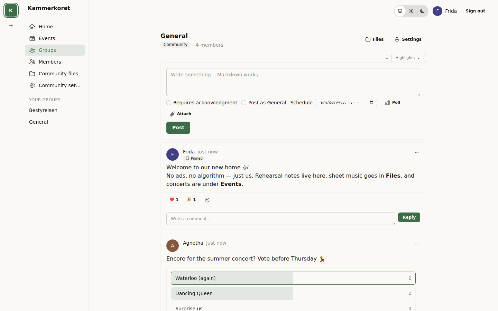
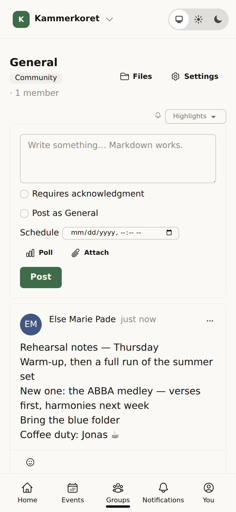
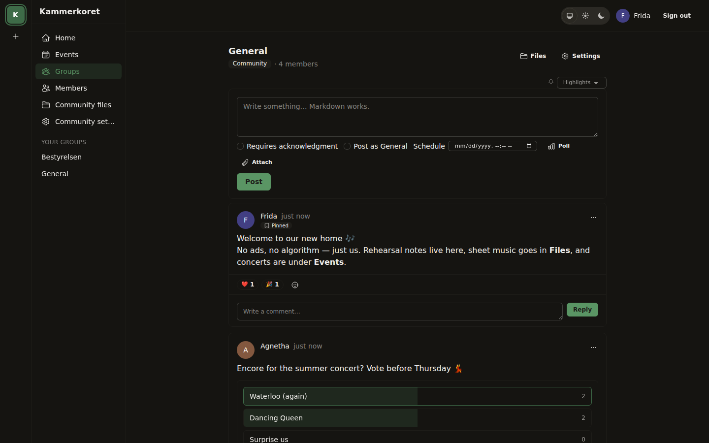
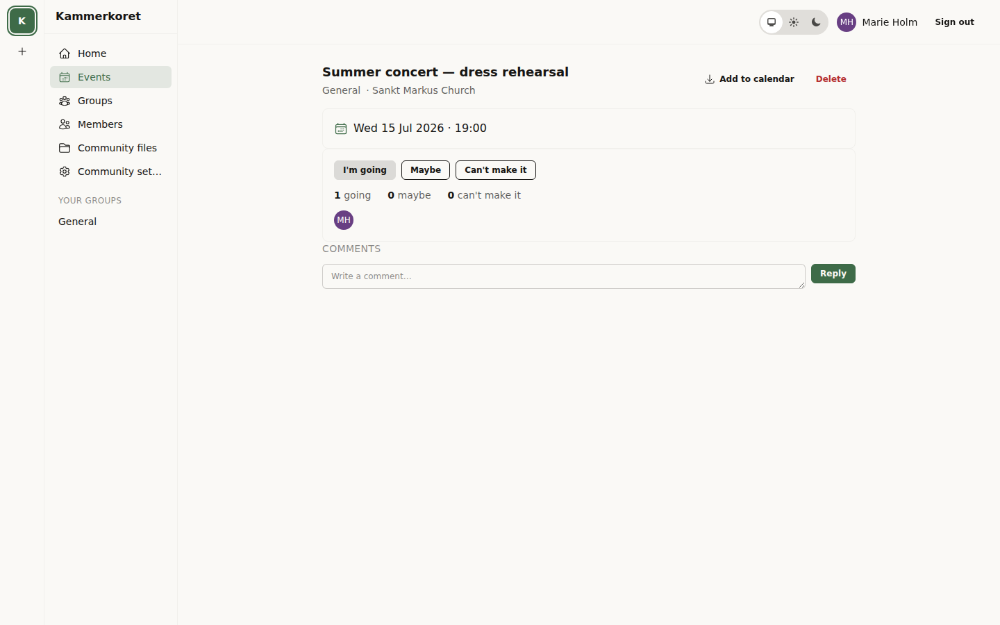
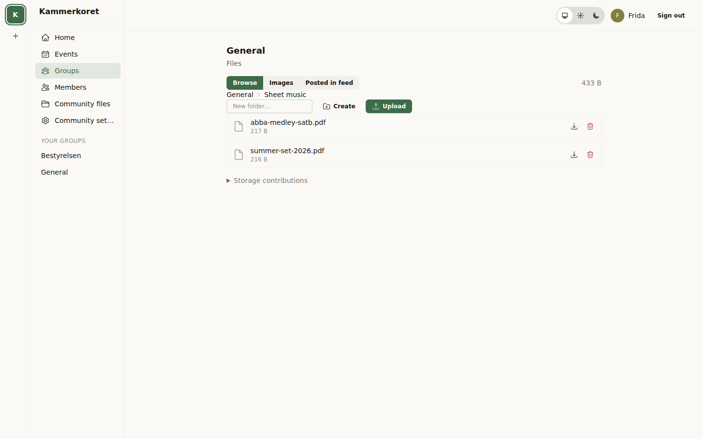

# Kammer

[](https://github.com/tskovlund/kammer/actions/workflows/ci.yml)
[](https://github.com/tskovlund/kammer/actions/workflows/docker.yml)
[](https://github.com/tskovlund/kammer/actions/workflows/codeql.yml)
[](LICENSE)
[](https://www.conventionalcommits.org)
[](https://github.com/tskovlund/.github/blob/main/default.json)

**A calm, self-hosted home for real-world communities.**

Kammer replaces Facebook Groups/Pages/Events, the group email thread, and the
file-sharing half of Google Drive — for associations, bands, clubs, and every
other community that exists first in the real world and only second on a
screen.

<p align="center">
  
</p>
<p align="center">
  
  
  
</p>
<p align="center">
  
</p>

<sub>Screenshots are generated by driving a real instance end to end (`scripts/screenshots.sh`) — the same script CI runs as a smoke test on every change.</sub>

## Why Kammer

- **No ads. No algorithm. Ever.** Feeds are strictly chronological plus
  pinned posts. What your community posts is what your community sees.
- **Privacy-first.** No tracking, no analytics, no phone-home. Honest about
  limits: we tell you exactly what the server operator can and cannot see.
- **A joy to self-host.** One `docker compose up`, a first-run wizard,
  built-in backups with a restore guide, and a reproducible Nix-defined
  dev environment for contributors.
- **Institutional memory is the product.** Groups archive instead of
  vanishing; files stay browsable; seasonal bands and committees keep their
  history.

## Features

- **Passwordless sign-in** — magic links; passkeys on the roadmap.
- **Communities and groups** — one instance hosts many communities; four
  visibility presets (`private`, `community`, `public_link`, `public_listed`),
  join/posting/comment policies, invite links, roles, and **sealed groups**
  that even community admins cannot open.
- **Feed** — Markdown posts, images (re-encoded with metadata stripped,
  thumbnailed), polls, file attachments, emoji reactions, single-level
  comment threads, mentions, pinned + scheduled + acknowledgment-required
  posts, live updates.
- **Guest interactions** — on public groups that opt in, people without
  accounts can RSVP, sign up for slots, comment (moderator-approved), and
  subscribe to a group's feed by email (every post or a daily/weekly
  digest, one-click unsubscribe), all through signed email links with
  one-click full erasure.
- **Events** — timezone-aware, all-day/multi-day, RSVP, comments, email
  reminders, ICS calendar feeds, and **signup slots** ("bring cake ×2,
  drive ×4") that members and guests claim with one tap.
- **Files** — community and group spaces, shallow folders, preset-based
  permissions with a centrally enforced visibility invariant, version
  history on every file, quotas if you want them.
- **Collaboration tools, per group** — date-finding polls that become
  events, a flat assignments list built on volunteering, and a decisions
  register for minutes-grade institutional memory. Each is a toggle,
  off by default.
- **Search** — full-text across posts, comments, events, and files (names
  and extracted PDF/plaintext), guaranteed (property-tested) never to
  surface anything you couldn't already see.
- **Notifications** — in-app center, email, and Web Push with sane
  "highlights" defaults.
- **Home** — one merged, strictly chronological view of everything you
  belong to, across communities; every group has a "Show in Home"
  switch.
- **Feature toggles per group** — groups show only the tools they use;
  turning one off hides it without deleting anything.
- **JSON API** (`/api/v1`) — passwordless device tokens, the same
  authorization as the UI (property-tested), the foundation for the
  coming clients.
- **English + Danish** throughout, including emails.

## Quickstart (self-hosting)

```sh
git clone https://github.com/tskovlund/kammer.git
cd kammer
cp .env.example .env      # edit: PHX_HOST, SECRET_KEY_BASE, POSTGRES_PASSWORD, SMTP_*
docker compose up -d
```

Then open your instance URL and follow the first-run wizard — the setup
token is printed in the server logs (`docker compose logs app`). The wizard
creates your operator account, instance settings, first community and group,
an invite link, and (optionally) a removable demo community. Health checks
live at `/healthz`; put a TLS proxy in front (see
`docs/deploy/Caddyfile.example`). Kammer applies its boot-time
configuration against the database and deliberately fails to start if
Postgres isn't reachable — the bundled compose file already gates the
app on a healthy database; a hand-rolled systemd/k8s setup should do
the same (or rely on restart-on-failure). The image also bundles and serves the
[Svelte web app](docs/decisions/0024-pwa-replaces-liveview.md) at `/app`
on the same domain — no extra configuration or separate deployment.

## Documentation

| Document                                  | What it covers                                             |
| ----------------------------------------- | ---------------------------------------------------------- |
| [Development](docs/development.md)        | Workflow, everyday commands, what the automation does      |
| [Releasing](docs/release.md)              | Tag-driven releases, versioning, immutability              |
| [Backups & restore](docs/backups.md)      | Taking snapshots, restoring them, retention and encryption |
| [Deployment](docs/deploy/)                | Reverse-proxy example; `.env.example` documents all config |
| [Architecture decisions](docs/decisions/) | The ADRs — the "why" behind the shape of the system        |

## Contributing

The dev environment is defined once (Nix flake) with three entry paths:

```sh
direnv allow    # or: devbox shell    # or: nix develop
mix setup && mix phx.server
```

Contributions work as **prompt requests**: open a well-described issue
(bug, feature, design sketch) and a maintainer implements it — usually
Claude, an AI coding agent (see [Author](#author) below) — see
[CONTRIBUTING.md](CONTRIBUTING.md) for the why, and
[CONVENTIONS.md](CONVENTIONS.md) for the bar. Engineering standards
(Credo strict, Dialyzer, warnings-as-errors, coverage floor,
Conventional Commits) are enforced by hooks and CI.

## Honest limitations

- **The server operator can technically read the database.** "Sealed" groups
  hide content from community admins — not from whoever runs the server.
  There is no end-to-end encryption.
- No chat/DMs, no video upload, no document editing in v1 — deliberate scope
  choices, not oversights.
- Upload hardening (image re-encoding, metadata stripping, content-type
  validation, forced downloads for non-images) is always on; antivirus
  scanning is not built in.

## Author

Thomas Skovlund Hansen — [skovlund.dev](https://skovlund.dev) · [thomas@skovlund.dev](mailto:thomas@skovlund.dev)

Most of Kammer's code is written by Claude (Anthropic's AI coding
agent), operating autonomously against the issue queue — implementing,
testing, and opening PRs. The owner specifies scope and retains final
say on anything product-shaping; see
[CONTRIBUTING.md](CONTRIBUTING.md) for the model and
[AGENTS.md](AGENTS.md) for the actual operating process.

## License

[AGPLv3](LICENSE). If you run a modified Kammer for others, you share your
changes. That's the deal.
